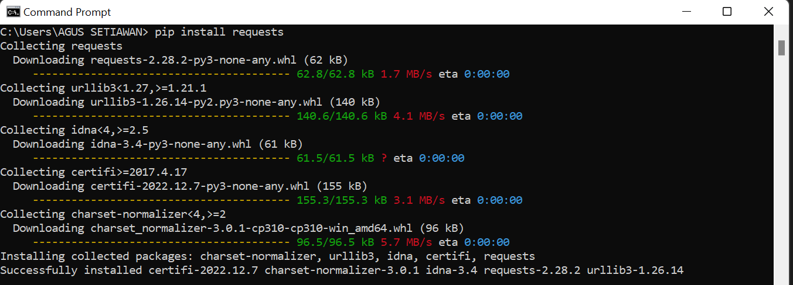

# praktikum11 
# - Scraping Web
Untuk melakukan scraping web kita memerlukan beberapa library dalam pyhton, diantaranya adalah request, bs4, pandas, dan beautifulsoup

## pip --version
untuk melihat versi PIP yang terinstal


## Install Library Request
untuk menginstall library request hanya perlu mengetik di terminal python anda seperti ini
```
pip install requests
```


## Install Library bs4
untuk menginstall bs4 request hanya perlu mengetik di terminal python anda seperti ini
```
pip install bs4
```


## Install Library pandas
untuk menginstall pandas request hanya perlu mengetik di terminal python anda seperti ini
```
pip install pandas
```


## Install Library beautifulsoup
untuk menginstall beautifulsoup request hanya perlu mengetik di terminal python anda seperti ini
```
pip install beautifulsoup4
```


## Contoh Pengguna
Untuk menampilkan daftar pakcage yang terinstal


## Contoh Latihan


## hasil latihan


- Selesai
